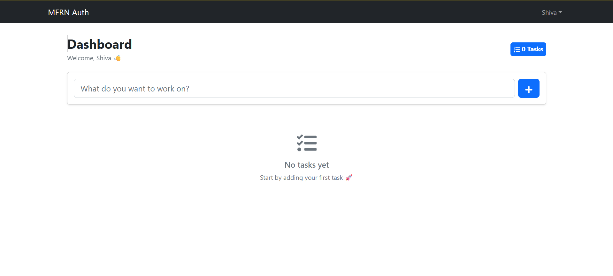

# 🚀 MERN Auth & Dashboard App

A full-stack web application built using the MERN stack with authentication, protected routes, and a task management dashboard.

---

## ✨ Features

- User Registration & Login (JWT Authentication)
- Protected Routes
- Task Dashboard (CRUD Operations)
- Responsive UI (Bootstrap)
- Secure Password Hashing (bcrypt)
- API Rate Limiting
- MongoDB Integration
- Redux State Management

---

## 🛠️ Tech Stack

### Frontend
- React (Vite)
- Redux Toolkit
- Bootstrap
- Axios

### Backend
- Node.js
- Express.js
- MongoDB
- Mongoose
- JWT
- bcrypt
- express-rate-limit

---

## ⚙️ Installation & Setup

### 1. Clone Repository

```bash
git clone <your-repo-url>
cd mern-auth
# Install backend dependencies
npm install

# Install frontend dependencies
cd frontend
npm install
cd ..
## 📸 Screenshots

### Login Page


### Dashboard


### Task Manager

